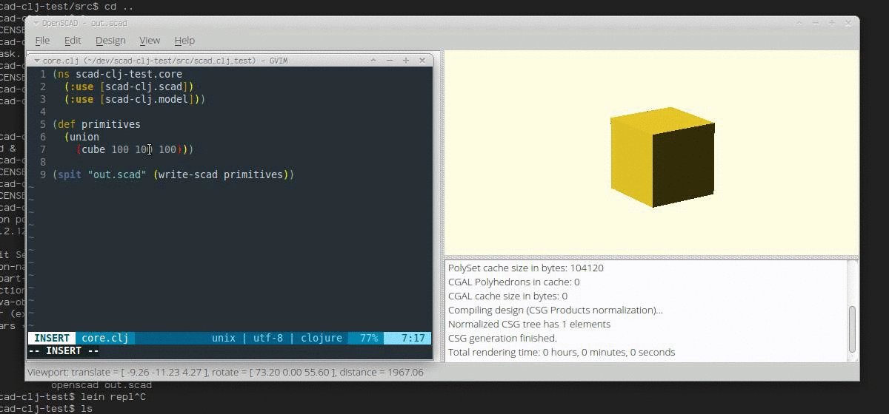

Basic example to get up and running with [scad-clj](https://github.com/farrellm/scad-clj) and do live editing of procedural 3d objects in Clojure.

 * `openscad out.scad`
 * Enable the "Design -> Automatic Reload and Compile" option in openscad.
 * `lein repl`.
 * edit `src/scad_clj_test/core.clj` and send buffer changes to see it live-update.

